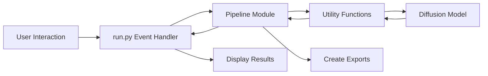
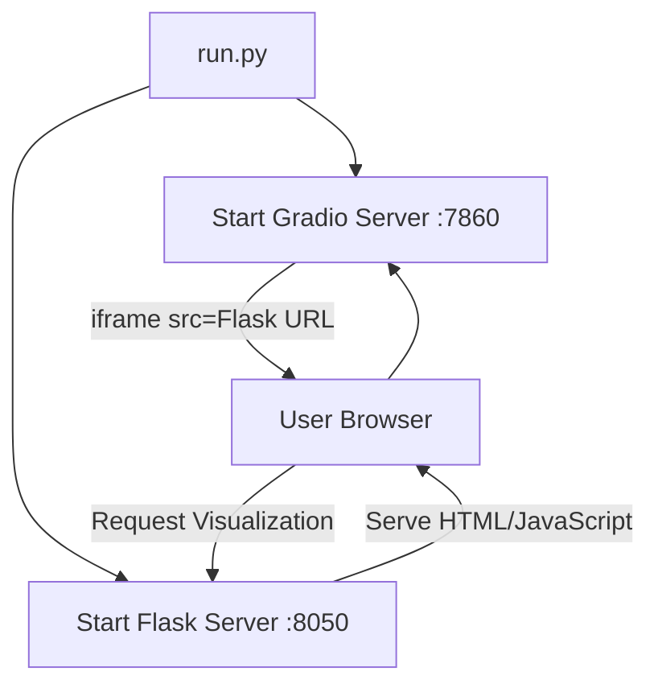

# Diffusion Demo Architecture

This document provides an overview of the Diffusion Demo application architecture, explaining how different components interact and how data flows through the system.

## System Components

The Diffusion Demo consists of several key components:

1. **Gradio UI (run.py)**: The main user interface that handles user interactions and displays results
2. **Pipeline Modules (src/pipelines/*)**: Feature-specific logic for different demonstration tabs
3. **Utility Modules (src/util/*)**: Shared functionality, model interactions, and helper functions
4. **Flask Server (serve.py)**: A secondary server specifically for serving interactive visualizations
5. **Session Management (src/util/session.py)**: Handles user session persistence and cleanup

## Data Flow

### Standard Pipeline Flow

For most tabs in the application (Beginner, Denoising, Seeds, etc.), the data flow follows this pattern:

1. **User Interaction**: User adjusts parameters and clicks a button in the Gradio UI
2. **Event Handler**: An event handler in `run.py` captures the interaction and parameters
3. **Pipeline Processing**: 
   - The event handler calls a function from the appropriate pipeline module
   - The pipeline module processes the request, using utilities from `src/util/*`
   - The utilities interact with the diffusion model to generate images
4. **Result Presentation**: Generated images and other outputs are returned to the Gradio UI
5. **Export Creation**: Results are packaged into downloadable ZIP files and/or GIFs



### Flask Server Integration

The application uses a separate Flask server (`serve.py`) specifically for serving content that Gradio can't handle natively, such as the interactive 3D plot in the Embeddings tab:

1. **Initialization**: When the application starts:
   - The main Gradio server starts on port 7860
   - A separate Flask server starts on port 8050
   - Both servers share access to session data and filesystem

2. **Serving Dynamic Content**:
   - The Flask server provides endpoints for interactive visualizations and dynamic images
   - The content is embedded in the Gradio UI using iframes



## Session Management

The application maintains user session state across both servers:

1. **Session Creation**: Each user gets a unique `session_hash` assigned by Gradio
2. **Data Storage**:
   - Session-specific data is stored in memory (`user_data` dictionary)
   - Files are saved to session-specific directories
3. **Session Cleanup**: A background thread periodically removes old session data

## Key Integration Points

1. **Shared Filesystem**: Both servers read/write to the same directories
2. **Session Identification**: The `session_hash` is passed between systems to identify users
3. **URL Generation**: The Gradio server generates URLs pointing to the Flask server
4. **Content Embedding**: Flask-served content is embedded in the Gradio UI using iframes 

# Embeddings Tab Architecture

The Embeddings tab is one of the most complex features in the Diffusion Demo, involving multiple servers, 3D visualization, and sophisticated session management.

## Overview

The Embeddings tab allows users to:
- Visualize word embeddings in 3D space
- Add and remove words to/from the visualization
- Generate images from word embeddings
- Define custom semantic dimensions as axes
- Explore relationships between different words in semantic space

## Component Interaction

### Key Components

1. **Gradio UI (run.py)**: Provides the user interface controls
2. **Embeddings Pipeline (src/pipelines/embeddings.py)**: Contains the core logic
3. **Flask Server (serve.py)**: Serves the interactive 3D visualization
4. **CLIP Model (src/util/base.py)**: Generates text embeddings
5. **Diffusion Model (src/util/base.py)**: Generates images from embeddings

## Data Flow

### Initialization Process

1. When a user first accesses the Embeddings tab:
   - `load_user_html()` is called during page load
   - `init_user_session()` creates or retrieves the user's session
   - A default set of words and axes are initialized
   - An initial 3D visualization is created using Plotly
   - The visualization is saved as HTML to the user's session directory
   - An iframe pointing to the Flask server is embedded in the Gradio UI

2. Session data structure in `user_data`:
   ```python
   user_data[session_hash] = {
       "examples": [],         # List of words displayed in the visualization
       "images": {},           # Dictionary mapping words to generated images
       "coords": np.array([]), # Coordinates of words in 3D space
       "axis": [...],          # The three semantic axes used for visualization
       "axis_names": [...]     # Names of the semantic axes
   }
   ```

### User Interactions

#### Adding/Removing Words

When a user submits a word via the "Add/Remove word" input:

1. The `add_rem_word_handler()` function is called in `run.py`
2. This calls `add_rem_word_user()` in `embeddings.py`, which:
   - Tokenizes and processes the input words
   - For each word:
     - If the word exists in examples, it's removed
     - If the word doesn't exist, it's added:
       - Gets the CLIP embedding for the word
       - Generates an image for the word
       - Projects the embedding to 3D using the current axes
       - Adds the word to the user's examples list
   - Updates the 3D visualization using Plotly
   - Saves the visualization as HTML
   - Returns the URL to access the visualization

3. The Gradio UI updates:
   - The iframe source is updated to point to the new visualization
   - The gallery is updated with current images
   - The browser storage is updated with the new state

#### Changing Semantic Axes

When a user defines a new semantic axis:

1. The appropriate `set_axis_wrapper()` function is called in `run.py`
2. This calls `set_axis_user()` in `embeddings.py`, which:
   - Processes positive and negative words to define the axis
   - Gets CLIP embeddings for all words
   - Calculates the axis vector (mean of positive embeddings - mean of negative embeddings)
   - Updates the axis in the user's session data
   - Recomputes 3D coordinates for all words using the new axes
   - Updates the 3D visualization
   - Saves the visualization as HTML

3. The function ensures no duplicate axis assignments by clearing other dropdowns

### Critical Implementation Details

#### 3D Visualization Serving

The 3D visualization is implemented using Plotly, which generates interactive HTML/JavaScript content:

1. `embeddings.py` creates and saves a Plotly figure to the user's session directory
2. `serve.py` exposes an endpoint `/plot/<session_hash>` that:
   - Looks up the user's session directory
   - Reads the HTML file from disk
   - Serves it with the correct MIME type

3. The Gradio UI embeds this content using an iframe pointing to the Flask server URL

#### Session State Management

The Embeddings tab uses multiple state management approaches:

1. **Server-side state** (`user_data` dictionary):
   - Stores all visualization data, word lists, and semantic axes
   - Accessible by both the Gradio and Flask servers
   - Tied to the user's session hash

2. **Browser-side state** (`embeddings_storage` using `gr.BrowserState`):
   - Preserves data across page refreshes
   - Synchronizes with server-side state when changes occur

3. **File-based persistence**:
   - HTML visualizations stored as files
   - Generated images stored as files
   - Allows sharing between Gradio and Flask servers

#### Image Generation and Gallery

When words are added to the visualization:

1. Images are generated using the diffusion model
2. Images are stored in memory, on disk, and in browser state
3. The gallery component displays these images with word labels
4. Images can be regenerated using the "Change image for word" input

## Challenges and Solutions

1. **Cross-server communication**: Solved via shared filesystem and standardized session hash
2. **State persistence across refreshes**: Solved with combination of server-side, browser-side, and file-based storage
4. **Dynamic update of 3D visualization**: Solved by regenerating the entire plot and refreshing the iframe source
